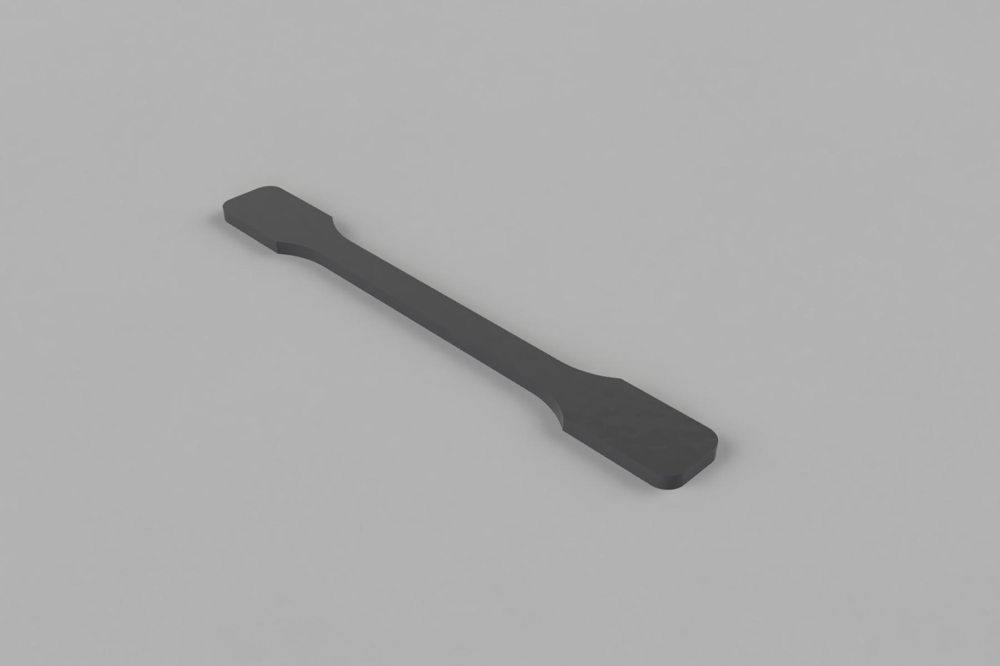
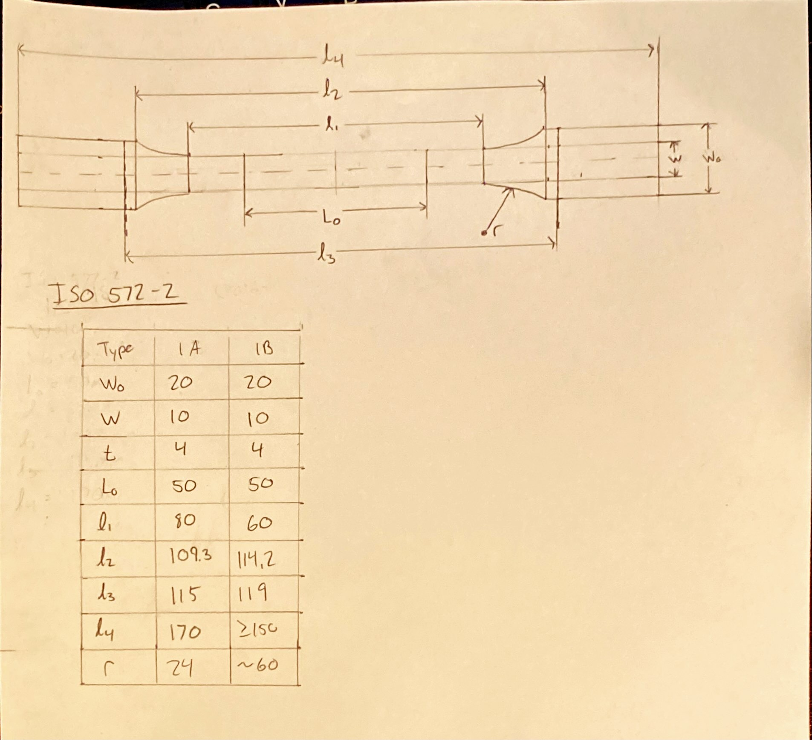

Test sample A1 Specimen as specified in the DIN EN ISO 572-2 Standards. Intended for tensile testing plastics. Geometry is shown in figure 2.

Figure 1: Render of test sample 1A model

Figure 2: Test sample 1A according to DIN EN ISO 527-1, all values in mm

